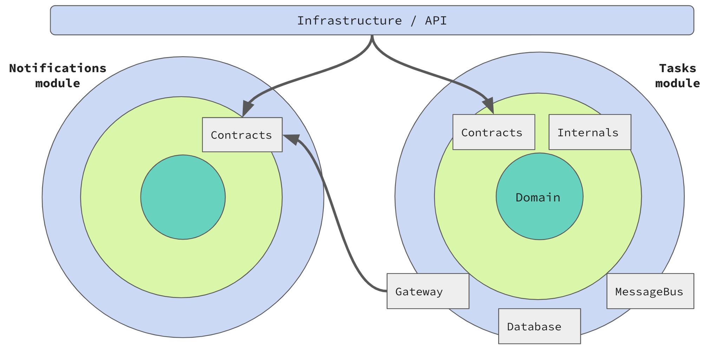

# ArchitectureTests

Проект предназначен для демонстрации возможностей архитектурных тестов. Представляет собой приложение для ведения списка дел. Реализован в виде модульного монолита. Внутри модулей используется Clean architecture.

Архитектурные тесты реализованы с помощью:
1. [ArchUnitNet](https://github.com/TNG/ArchUnitNET)
2. [NetArchTest](https://github.com/BenMorris/NetArchTest)

## Источники

### Архитектура

1. Building Evolutionary Architectures. Neal Ford, Rebecca Parsons, Patrick Kua
1. Clean Architecture: A Craftsman's Guide to Software Structure and Design. Robert C. Martin
1. [Who Needs an Architect?](https://martinfowler.com/ieeeSoftware/whoNeedsArchitect.pdf) Martin Fowler
1. [Is High Quality Software Worth the Cost?](https://martinfowler.com/articles/is-quality-worth-cost.html) Martin Fowler
1. [Vertical Slice Architecture](https://jimmybogard.com/vertical-slice-architecture/) Jimmy Bogard
1. [PresentationDomainDataLayering](https://martinfowler.com/bliki/PresentationDomainDataLayering.html) Martin Fowler

### Архитектурные тесты

1. [Unit Test Your Architecture with ArchUnit](https://blogs.oracle.com/javamagazine/post/unit-test-your-architecture-with-archunit) Jonas Havers
1. [Writing ArchUnit style tests for .NET and C# for self testing architecture rules](https://www.ben-morris.com/writing-archunit-style-tests-for-net-and-c-for-self-testing-architectures/)

